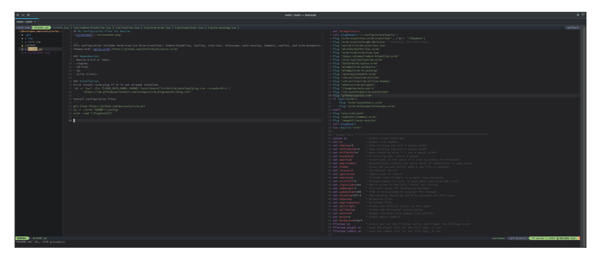

## My Configuration files for Neovim.


___
This configuration includes Nvim-tree.lua Nvim-treesitter, Indent-blankline, lualine, colorizer, telescope, auto-session, Comment, copilot, and nvim-autopairs.

Themed with [spice.nvim](https://github.com/ItsTerm1n4l/spice.nvim)

### Dependencies.
- Neovim 0.9.0 or later.
- ripgrep.
- fd-find.
- jq.
- xclip (Linux).

### Installation.
First install nvim-plug if it is not already installed.
`sh -c 'curl -fLo "${XDG_DATA_HOME:-$HOME/.local/share}"/nvim/site/autoload/plug.vim --create-dirs \
       https://raw.githubusercontent.com/junegunn/vim-plug/master/plug.vim'`

Install configuration files.

```sh
git clone https://github.com/marssola/nvim.git
cp -r ./nvim "$HOME"/.config/
```

### Install plugins.

For the first time, open nvim and run `:PlugInstall` to install the plugins or run the following command.

```sh
nvim --cmd ":PlugInstall"
```

